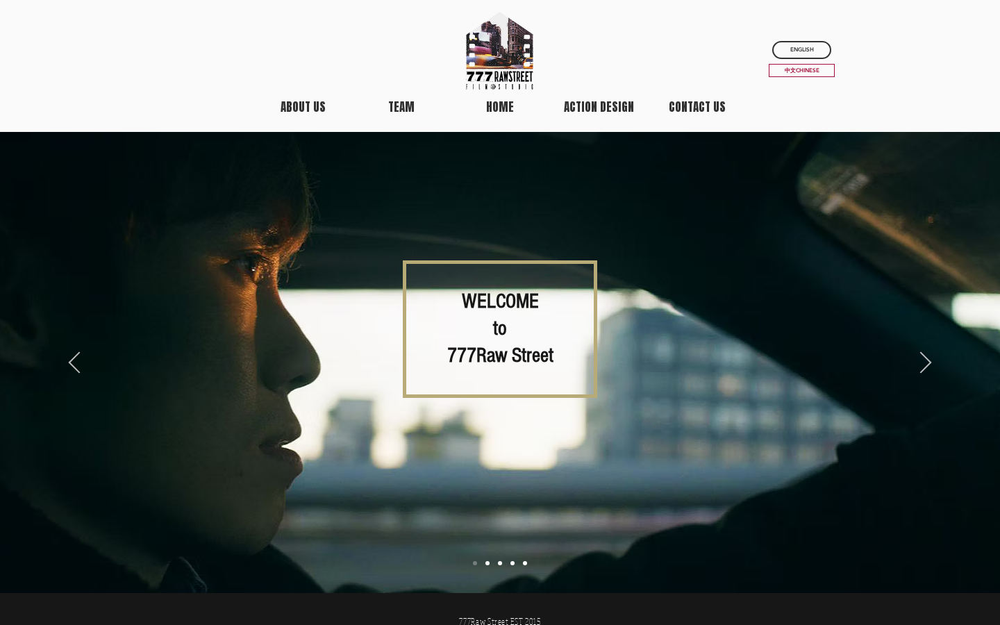

# 777 Raw Street

  

<strong>Public website for a New York action and art film studio.</strong>

  <a href="https://777rawstreet.com">Open the public site</a> ·
  <a href="product-guide.md">Product guide</a> ·
  <a href="changelog.md">Changelog</a> ·
  <a href="https://github.com/dylanwlim/777rawstreet-docs/discussions">Discussions</a>

777 Raw Street presents a bilingual studio website with homepage carousel content and public navigation for About Us, Team, Action Design, and Contact Us.

## What You Can Do Today

| Area | Current public flow |
| --- | --- |
| Choose language | Use the English or Chinese entry points shown on the public homepage. |
| Browse studio pages | Use About Us, Team, Home, Action Design, and Contact Us navigation. |
| Review homepage media | Use carousel controls to move through featured homepage slides. |
| Contact the studio | Use the Contact Us page path shown in the public navigation. |

## Start Here

1. Open the public homepage.
2. Choose English or Chinese if prompted by the visible entry links.
3. Use the top navigation to browse studio information, team, action design, or contact details.

## Guide Index

- [Overview](overview.md)
- [Product guide](product-guide.md)
- [How it works](how-it-works.md)
- [Access guide](build-and-run.md)
- [Roadmap](roadmap.md)
- [Changelog](changelog.md)
- [Security and privacy](security-and-privacy.md)
- [Access and updates](setup.md)

## Current Status

The public homepage is live with English/Chinese entry links, carousel controls, About Us, Team, Action Design, and Contact Us navigation.

## Updates

Public docs updates are reviewed from the source guide files before they are mirrored here. Each refresh keeps the homepage screenshot, approved guide set, and public changelog aligned with the current user-visible surface.
